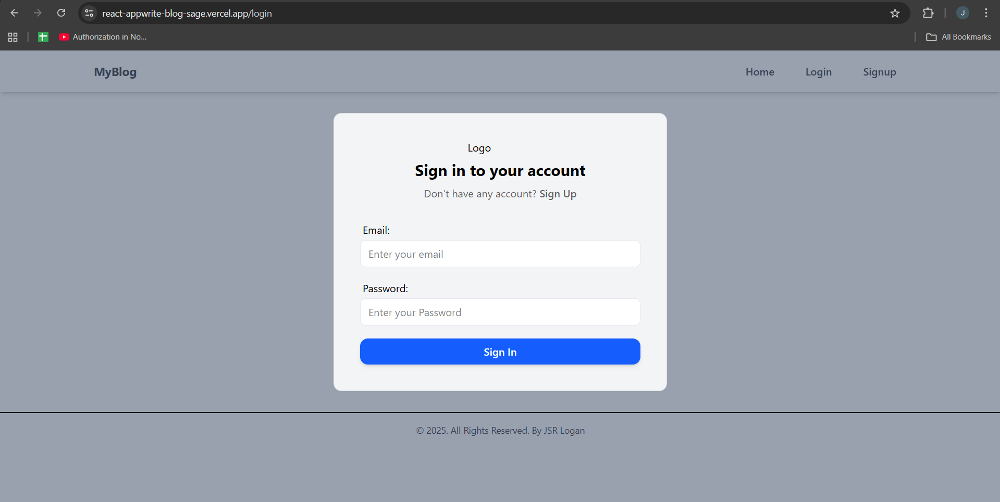
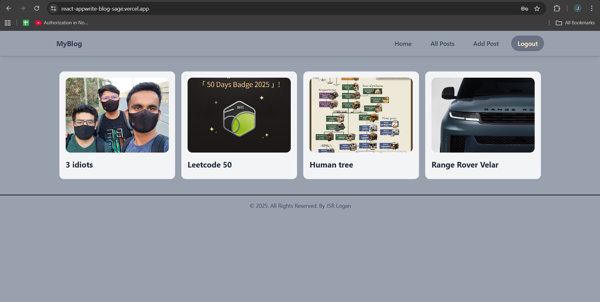
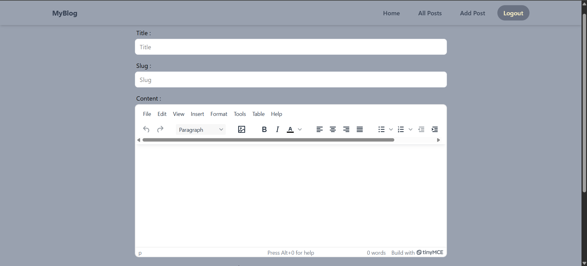

# 📖 MyBlog

A full-stack blogging platform built with **React, Redux Toolkit, Tailwind CSS, and Appwrite**, featuring authentication, post management, and a rich text editor.

🔗 **Live Demo**: [MyBlog](https://react-appwrite-blog-sage.vercel.app/)  
💻 **GitHub Repo**: [react-appwrite-blog](https://github.com/JSRxLogan/react-appwrite-blog)

---

## ✨ Features

- 🔐 **Authentication**: Signup/Login using Appwrite  
- 📝 **Post Management**: Create, update, and delete posts (only if authorized)  
- 📄 **Active/Inactive Posts**: Toggle post status visibility  
- 🖼️ **Image Uploads**: Supports `.png` and `.jpg` images  
- 🎨 **Rich Text Editing**: Powered by TinyMCE  
- 📱 **Responsive UI**: Built with Tailwind CSS  

---

## 🚀 Tech Stack

- **Frontend**: React, Redux, Redux Toolkit, React Router, Tailwind CSS  
- **Backend**: Appwrite (authentication, database, storage)  
- **Text Editor**: TinyMCE  
- **Deployment**: Vercel  

---

## 📸 Screenshots

### -> Login page


### -> Home Page


### -> Create Post


---

## 📚 Learning Journey

This project was built as part of my React learning journey with the Chai aur React series by Hitesh Choudhary sir.

At first, I only managed to make a broken version that barely ran. After months of pausing and revisiting, I debugged, fixed, and successfully deployed it. While the UI and speed are not the most attractive, this is my first complete full-stack project — and it will always be special to me.

---

## 🤝 Contributing

Contributions, issues, and feature requests are welcome!
Feel free to fork this repo and submit a pull request.
---


## ⚡ Getting Started

Follow these steps to run the project locally:

### 1. Clone the repository

```bash
git clone https://github.com/JSRxLogan/react-appwrite-blog.git
cd react-appwrite-blog
````

---

### 2. Setup Appwrite & TinyMCE Environment Variables

Before running the project, you need to set up Appwrite and TinyMCE:

#### a) Create an Appwrite Project

1. Go to [Appwrite Console](https://appwrite.io/) and log in or create an account.
2. Create a **new project**.
3. Note down the **Project ID** and **API endpoint URL**.

#### b) Create Required Resources

* **Database**: Create a database for posts and note its **Database ID**.
* **Collection**: Create a collection inside the database and note its **Collection ID**.
* **Storage Bucket**: Create a bucket for image uploads and note its **Bucket ID**.

#### c) TinyMCE API Key

* Sign up on [TinyMCE](https://www.tiny.cloud/) to get a free API key for the rich text editor.

#### d) Set Environment Variables

Create a `.env` file in the root of your project with the following:

```env
VITE_APPWRITE_URL="YOUR_APPWRITE_URL"
VITE_APPWRITE_PROJECT_ID="YOUR_PROJECT_ID"
VITE_APPWRITE_COLLECTION_ID="YOUR_COLLECTION_ID"
VITE_APPWRITE_DATABASE_ID="YOUR_DATABASE_ID"
VITE_APPWRITE_BUCKET_ID="YOUR_BUCKET_ID"
VITE_TINYMCE_API_KEY="YOUR_TINYMCE_API_KEY"
```

> Replace `YOUR_*` with the actual values from Appwrite and TinyMCE.

---

### 3. Install Dependencies

```bash
npm install
```

---

### 4. Start the Development Server

```bash
npm run dev
```


